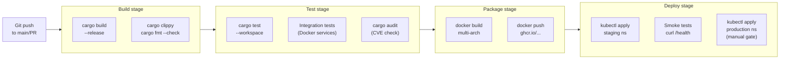

# CI/CD pipeline architecture

This page describes how AgilePlatform's own CI/CD runs — separate from the pipeline service that *manages* pipelines for users.

## Pipeline stages



## Multi-stage Dockerfile

```dockerfile
# Stage 1 — build
FROM rust:1.78-alpine AS builder
WORKDIR /app
RUN apk add --no-cache musl-dev
COPY Cargo.toml Cargo.lock ./
COPY services/ services/
COPY libs/ libs/
RUN cargo build --release --bin auth

# Stage 2 — minimal runtime image
FROM alpine:3.19
RUN apk add --no-cache ca-certificates
COPY --from=builder /app/target/release/auth /usr/local/bin/auth
EXPOSE 8001
CMD ["auth"]
```

:::tip Tiny images
The final Docker image for each service is **~12–18MB**. The Rust binary is statically linked against musl libc — no runtime dependencies, no JVM, no interpreter.
:::

## Health checks

Every service exposes `/health` and `/ready`:

| Endpoint | Returns | Checks |
|---|---|---|
| `GET /health` | `200 OK` | Service is running |
| `GET /ready` | `200 OK` | DB + Redis connections healthy |

```rust
pub async fn health_handler() -> impl IntoResponse {
    Json(serde_json::json!({ "status": "ok" }))
}

pub async fn ready_handler(
    State(state): State<AppState>,
) -> impl IntoResponse {
    let db_ok = sqlx::query("SELECT 1").fetch_one(&state.db).await.is_ok();
    let redis_ok = state.redis.get().await
        .map(|mut c| deadpool_redis::redis::cmd("PING")
            .query_async::<_, String>(&mut c))
        .is_ok();

    if db_ok && redis_ok {
        (StatusCode::OK, Json(json!({ "status": "ready" })))
    } else {
        (StatusCode::SERVICE_UNAVAILABLE, Json(json!({ "status": "degraded" })))
    }
}
```
