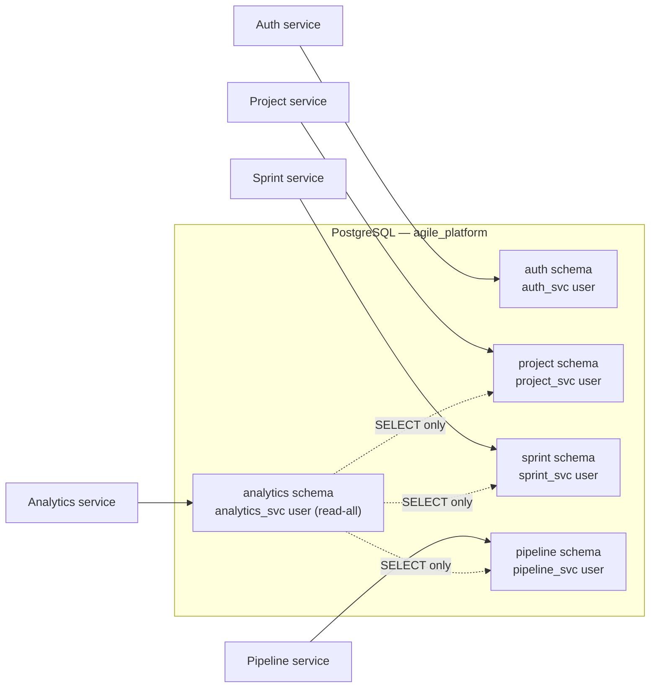
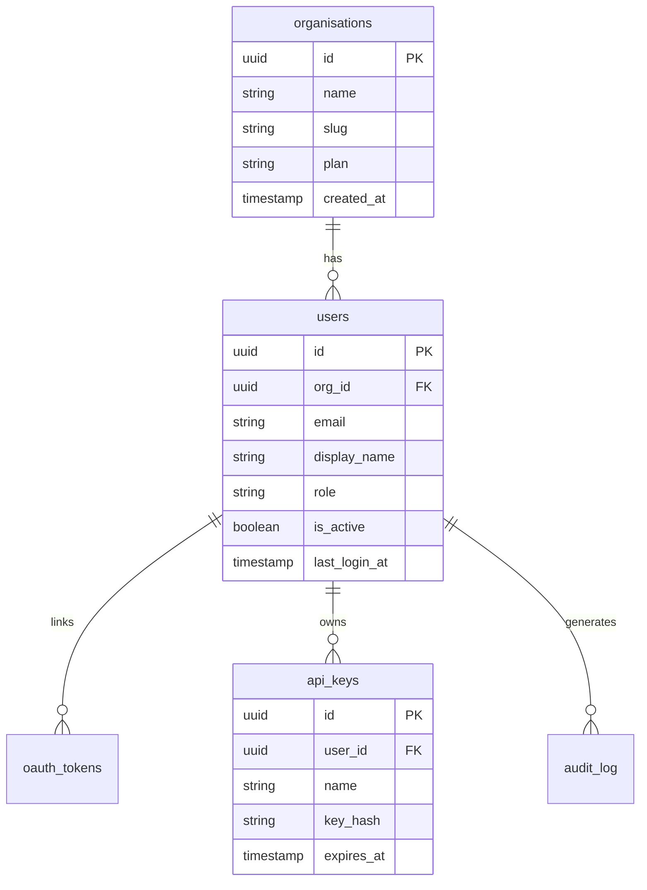
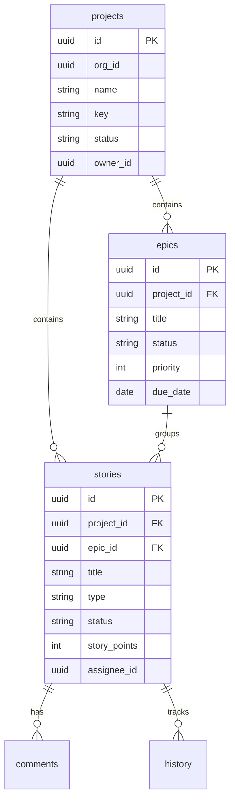
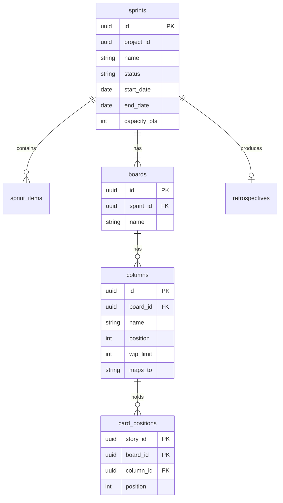
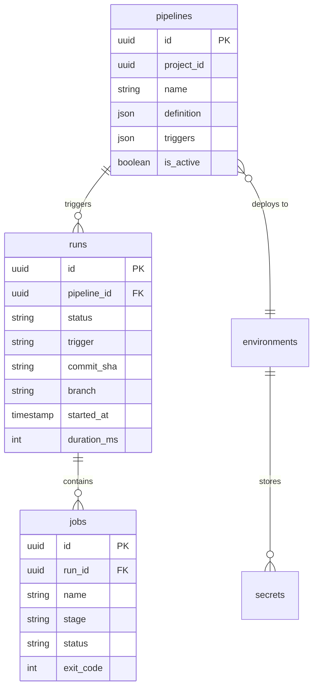

# Database design

AgilePlatform uses a single PostgreSQL 16 cluster with **five isolated schemas** — one per service. This pattern gives you the operational simplicity of a monolithic database with the access isolation of separate databases.

## Schema layout



:::info Analytics cross-schema reads
The `analytics_svc` user is granted `SELECT` on `project`, `sprint`, and `pipeline` schemas so it can compute cross-service metrics like cycle time and throughput. It has no write access to those schemas.
:::

## Auth schema



## Project schema



## Sprint schema



## Pipeline schema



## Migration strategy

Migrations are managed per-service using [Refinery](https://github.com/rust-db/refinery). Each service has its own `migrations/` directory.

```bash
# Run migrations for the auth service
cargo run -p auth -- migrate

# Check migration status
cargo run -p auth -- migrate status
```

Migration files follow the naming convention `V{version}__{description}.sql`:

```
services/auth/migrations/
  V1__create_organisations.sql
  V2__create_users.sql
  V3__create_oauth_tokens.sql
  V4__create_api_keys.sql
  V5__create_audit_log.sql
```
