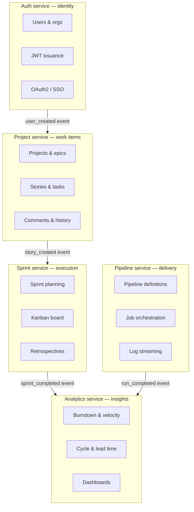

# Microservices design

Each service is an independent Rust binary — separate compile unit, separate process, separate data ownership.

## Service boundaries

## Inter-service communication

Services never call each other via HTTP. All cross-service communication is **async via NATS JetStream events**.

| Publisher | Event | Subscribers |
|---|---|---|
| Auth | `user.created` | Project, Analytics |
| Auth | `org.plan_changed` | All services |
| Project | `story.created` | Analytics |
| Project | `story.status_changed` | Sprint, Analytics |
| Sprint | `sprint.completed` | Analytics |
| Pipeline | `run.completed` | Analytics |
| Pipeline | `run.failed` | Auth (for notifications) |
