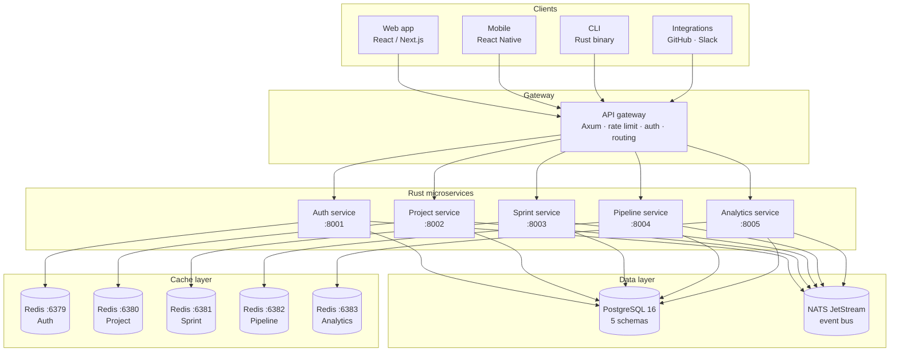

# Architecture overview

AgilePlatform is built as a set of independent Rust microservices. Each service owns its own PostgreSQL schema and Redis instance, communicates via a shared NATS message bus, and exposes a REST + WebSocket API through a central gateway.

## System diagram

## Design principles

### 1. Schema-per-service isolation
All five services share one PostgreSQL cluster but each owns a dedicated schema. Service users are granted access only to their own schema — a query from `sprint_svc` literally cannot read `auth.users`.

### 2. Redis-per-service
Each service has its own Redis instance with a tuned `maxmemory-policy`. No shared key namespace means no collisions and independent eviction behaviour.

### 3. Async-first with Tokio
Every service is built on `tokio` with `async/await` throughout — from HTTP handlers to database queries (`sqlx`) to cache operations (`deadpool-redis`).

### 4. Event-driven with NATS
Cross-service communication happens via NATS JetStream events, not direct HTTP calls. This keeps services decoupled and makes the system resilient to partial failures.

## Port map

| Service | HTTP port | Description |
|---|---|---|
| API Gateway | 3000 | Public-facing entry point |
| Auth service | 8001 | JWT, OAuth2, SSO |
| Project service | 8002 | Projects, epics, stories |
| Sprint service | 8003 | Sprints, kanban board |
| Pipeline service | 8004 | CI/CD pipelines and runners |
| Analytics service | 8005 | Reports and metrics |
| PostgreSQL | 5432 | Primary database |
| NATS | 4222 | Message bus |
| Redis (auth) | 6379 | Auth cache |
| Redis (project) | 6380 | Project cache |
| Redis (sprint) | 6381 | Board state + presence |
| Redis (pipeline) | 6382 | Job queue + log streams |
| Redis (analytics) | 6383 | Report cache |
