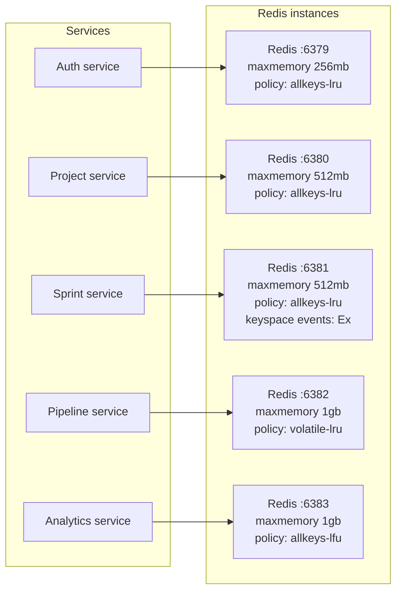
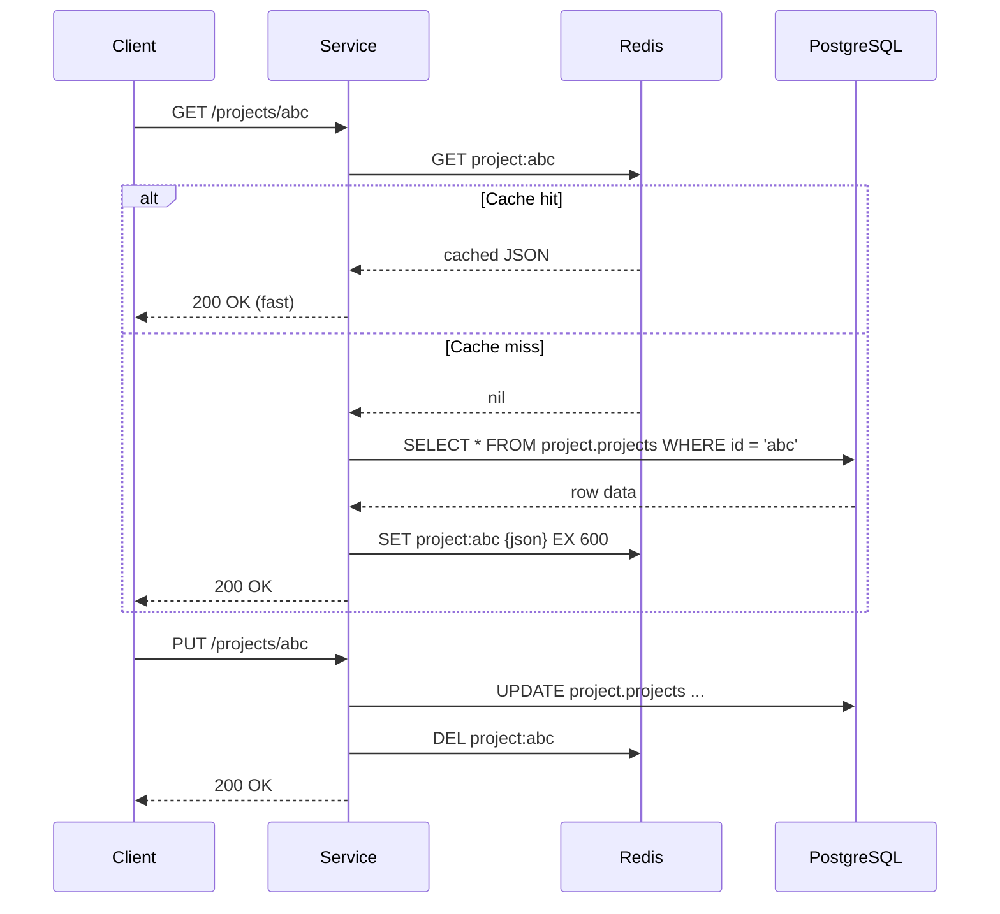
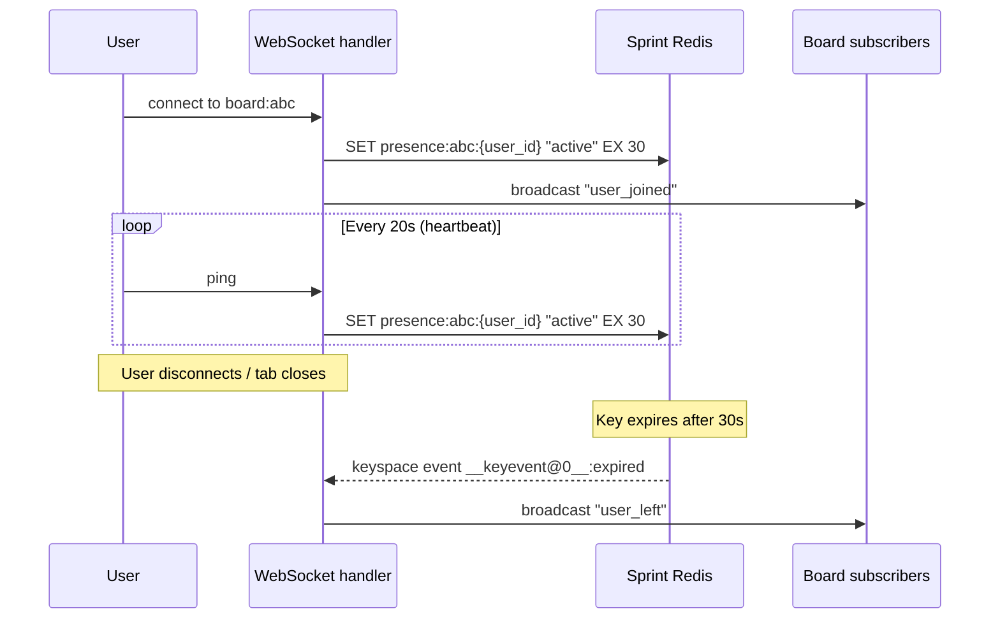
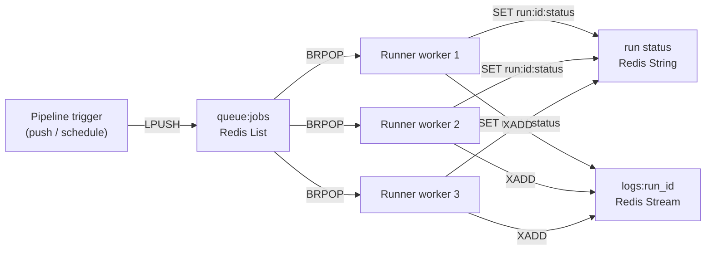

# Redis cache strategy

Each service owns a dedicated Redis instance. This means independent memory limits, eviction policies, and zero risk of key collision between services.

## Instance map



## Eviction policy decisions

| Service | Policy | Reason |
|---|---|---|
| Auth | `allkeys-lru` | All keys are re-creatable; evict oldest |
| Project | `allkeys-lru` | Cache is a read optimisation; safe to evict |
| Sprint | `allkeys-lru` | Board state is rebuilt from PG on miss |
| Pipeline | `volatile-lru` | Job queue entries have **no TTL** — must never be evicted; only cached items (with TTL) are evicted |
| Analytics | `allkeys-lfu` | Keep frequently-accessed dashboards; drop cold ones |

## Cache pattern — read-through with write invalidation



## Key reference

### Auth Redis (:6379)

| Key pattern | Type | TTL | Purpose |
|---|---|---|---|
| `session:{user_id}` | String | 24h | Active session data |
| `refresh:{token}` | String | 7d | Refresh token |
| `blacklist:{jti}` | String | Token exp | Revoked JWTs |
| `ratelimit:{ip}` | String | 1m | Login rate limiting |
| `perms:{user_id}` | String | 5m | Cached permissions |

### Sprint Redis (:6381) — special patterns

The sprint Redis has `notify-keyspace-events Ex` enabled. When a `presence:{board_id}` key expires (TTL 30s), Redis emits a keyspace event. The WebSocket handler subscribes to these events and broadcasts "user left" to all board subscribers — no polling required.



### Pipeline Redis (:6382) — job queue

The pipeline service uses Redis Lists as a job queue — items pushed without a TTL so `volatile-lru` never evicts them.



## Rust connection code

```rust
use deadpool_redis::{Config, Pool, Runtime};

pub fn make_redis_pool(url: &str, max_size: usize) -> Pool {
    Config {
        url: Some(url.to_string()),
        pool: Some(deadpool_redis::PoolConfig {
            max_size,
            ..Default::default()
        }),
        ..Default::default()
    }
    .create_pool(Some(Runtime::Tokio1))
    .expect("failed to create Redis pool")
}

// Usage in a handler
pub async fn get_project(
    State(state): State<ProjectState>,
    Path(id): Path<Uuid>,
) -> Result<Json<Project>, AppError> {
    let cache_key = format!("project:{id}");

    // 1. Try cache
    let mut conn = state.redis.get().await?;
    if let Ok(cached) = conn.get::<_, String>(&cache_key).await {
        return Ok(Json(serde_json::from_str(&cached)?));
    }

    // 2. Hit database
    let project = sqlx::query_as!(Project,
        "SELECT * FROM project.projects WHERE id = $1",
        id
    )
    .fetch_one(&state.db)
    .await?;

    // 3. Populate cache
    let _ = conn.set_ex::<_, _, ()>(
        &cache_key,
        serde_json::to_string(&project)?,
        600,
    ).await;

    Ok(Json(project))
}
```
