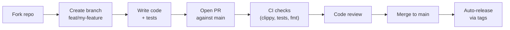

# Contributing

## Development flow



## Commit convention

We follow [Conventional Commits](https://www.conventionalcommits.org):

```
feat(sprint): add WIP limit enforcement
fix(auth): handle expired refresh token gracefully
docs(api): add WebSocket message format
chore(deps): upgrade sqlx to 0.8
```

## PR checklist

- [ ] `cargo test --workspace` passes
- [ ] `cargo clippy --workspace` has no warnings
- [ ] `cargo fmt --all --check` passes
- [ ] New public APIs have doc comments
- [ ] Migration files included if schema changes
- [ ] `CHANGELOG.md` updated
