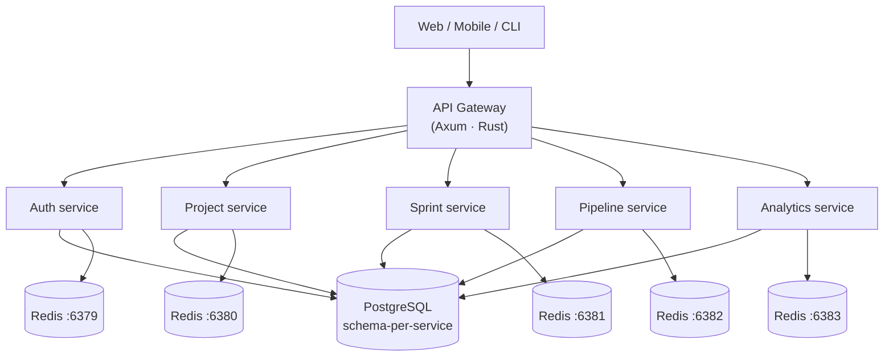

# AgilePlatform

**AgilePlatform** is an open-source, high-performance agile project management platform built with a Rust backend. Think of it as a faster, self-hostable alternative to Jira or Azure DevOps — designed to serve teams of any size without the bloat.

## Why AgilePlatform?

| | Jira | Azure DevOps | **AgilePlatform** |
|---|---|---|---|
| Backend language | Java | .NET | **Rust** |
| API latency | ~200–800ms | ~150–500ms | **~2–15ms** |
| Self-hostable | Paid | Paid | **Free** |
| Docker image size | ~800MB | ~1.2GB | **~35MB** |
| WebSocket connections | Limited | Limited | **100k+ per node** |
| Open source | ✗ | ✗ | **✓** |

## Core features

- **Backlog & sprint planning** — epics, stories, tasks, story points, velocity
- **Kanban board** — real-time drag-and-drop with WIP limits and swimlanes
- **CI/CD pipelines** — YAML-defined pipelines with parallel stages and runners
- **Analytics & reporting** — burndown, velocity, cycle time, lead time, CFD
- **Realtime collaboration** — WebSocket-powered board presence and live updates
- **Integrations** — GitHub, GitLab, Slack, Figma

## Architecture at a glance



## Quick start

```bash
# Clone the repo
git clone https://github.com/bzy-fuzy/agile-platform
cd agile-platform

# Start all infrastructure
docker compose up -d

# Run database migrations
cargo run -p migrations

# Start a service
cargo run -p auth
```

See the [Local Setup guide](./guides/local-setup) for full instructions.
