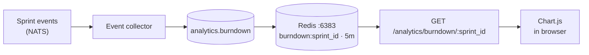

# Analytics service

Aggregates data from all other services and produces metrics: burndown charts, velocity, cycle time, lead time, and cumulative flow diagrams.

**Port:** `8005` | **Schema:** `analytics` | **Redis:** `:6383`

## Burndown chart data flow

## Key metrics

| Metric | Description | Resets |
|---|---|---|
| **Velocity** | Story points completed per sprint | Per sprint |
| **Burndown** | Remaining points over sprint duration | Per sprint |
| **Cycle time** | Time from In Progress → Done | Rolling 30d |
| **Lead time** | Time from Backlog → Done | Rolling 30d |
| **Throughput** | Stories completed per week | Rolling |
| **CFD** | Stories in each status over time | Cumulative |
