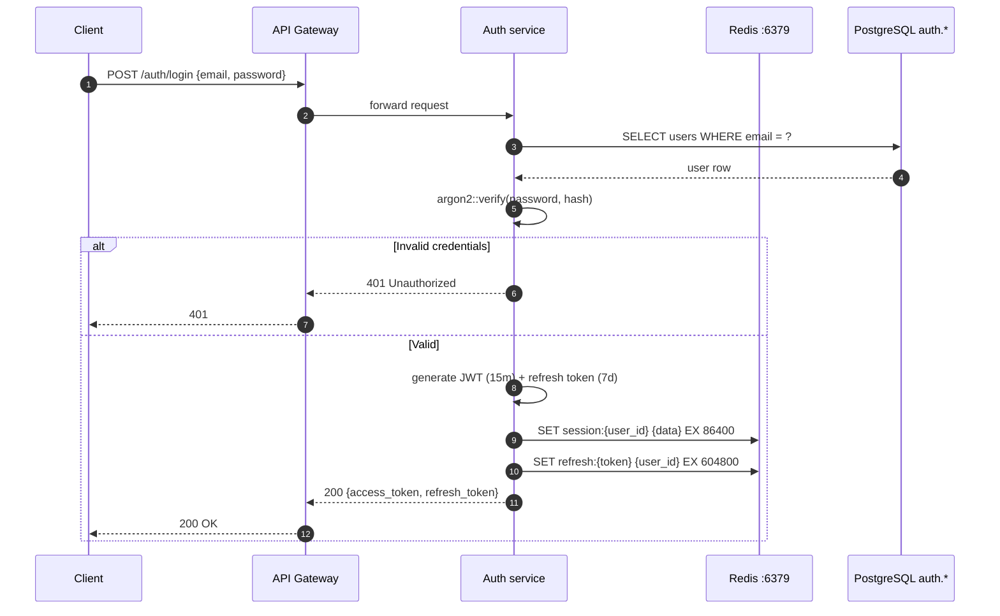
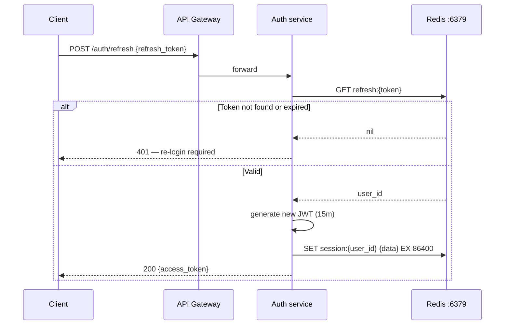
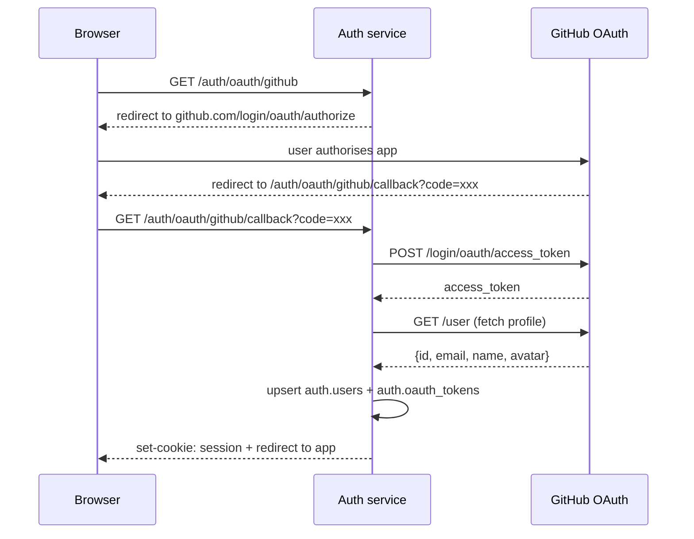

# Auth service

The auth service handles all identity concerns: registration, login, JWT issuance, OAuth2 (GitHub / Google / GitLab), API keys, and organisation management.

**Port:** `8001`  
**Database schema:** `auth`  
**Redis:** `:6379` — sessions, JWT blacklist, rate limits, permissions cache

## Authentication flow



## Token refresh flow



## OAuth2 flow (GitHub example)



## API endpoints

| Method | Path | Description |
|---|---|---|
| `POST` | `/auth/register` | Register new user + org |
| `POST` | `/auth/login` | Email/password login |
| `POST` | `/auth/refresh` | Refresh access token |
| `POST` | `/auth/logout` | Revoke session |
| `GET` | `/auth/me` | Current user profile |
| `GET` | `/auth/oauth/:provider` | Start OAuth2 flow |
| `GET` | `/auth/oauth/:provider/callback` | OAuth2 callback |
| `POST` | `/auth/api-keys` | Create API key |
| `DELETE` | `/auth/api-keys/:id` | Revoke API key |

## Rate limiting

Login attempts are rate-limited per IP using Redis:

```rust
// Max 10 attempts per minute per IP
pub async fn check_rate_limit(redis: &RedisPool, ip: &str) -> Result<(), AppError> {
    let key = format!("ratelimit:{ip}");
    let mut conn = redis.get().await?;

    let count: i64 = conn.incr(&key, 1).await?;
    if count == 1 {
        conn.expire::<_, ()>(&key, 60).await?;
    }
    if count > 10 {
        return Err(AppError::RateLimited);
    }
    Ok(())
}
```

## JWT structure

```json
{
  "sub": "018e4b2a-uuid-user-id",
  "org": "018e4b2a-uuid-org-id",
  "role": "admin",
  "jti": "018e4b2a-uuid-token-id",
  "iat": 1712000000,
  "exp": 1712000900
}
```

:::tip Short-lived access tokens
Access tokens expire in **15 minutes**. This limits the blast radius of a leaked token. The refresh token (7 days) is stored `httpOnly` and is never accessible from JavaScript.
:::
