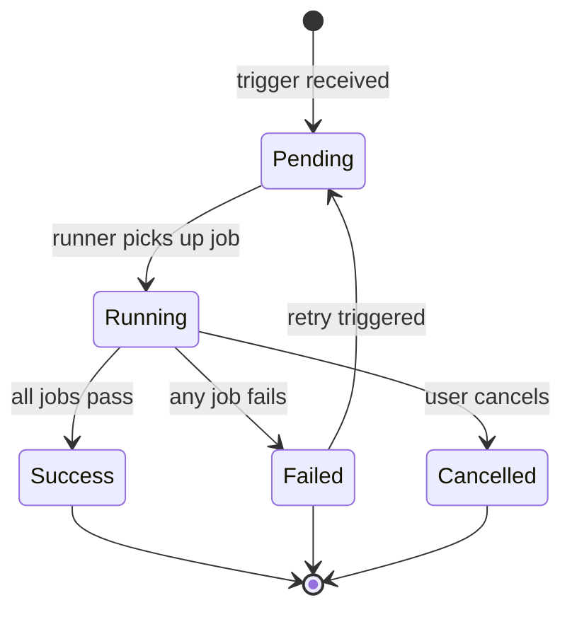
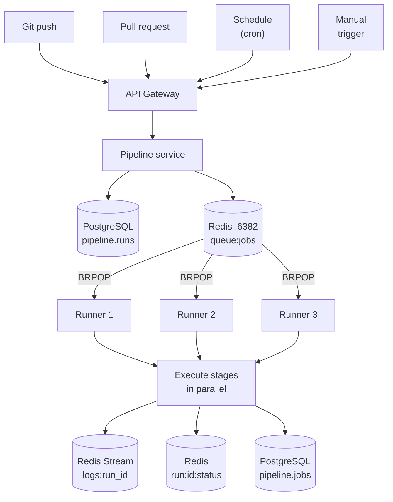
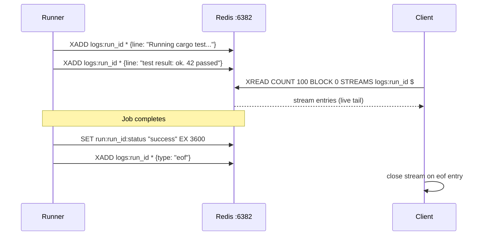

# Pipeline service

The pipeline service manages CI/CD pipeline definitions, orchestrates job execution across runners, streams live logs, and records deployment history.

**Port:** `8004`  
**Database schema:** `pipeline`  
**Redis:** `:6382` — job queue (List), run status (String), log streams (Stream)

## Pipeline run lifecycle



## Trigger → run flow



## Pipeline YAML definition

Pipelines are defined in `.agile-ci.yml` at the repo root:

```yaml
name: Build and deploy

on:
  push:
    branches: [main, develop]
  pull_request:
    branches: [main]

stages:
  - build
  - test
  - deploy

jobs:
  compile:
    stage: build
    image: rust:1.78-alpine
    script:
      - cargo build --release
    artifacts:
      paths:
        - target/release/app

  unit-tests:
    stage: test
    image: rust:1.78-alpine
    script:
      - cargo test
    needs: [compile]

  integration-tests:
    stage: test
    image: rust:1.78-alpine
    script:
      - cargo test --test integration
    needs: [compile]

  deploy-staging:
    stage: deploy
    environment: staging
    script:
      - docker build -t $IMAGE .
      - docker push $IMAGE
      - kubectl rollout restart deployment/app-staging
    only:
      - develop
    needs: [unit-tests, integration-tests]

  deploy-production:
    stage: deploy
    environment: production
    when: manual
    script:
      - kubectl rollout restart deployment/app-production
    only:
      - main
    needs: [unit-tests, integration-tests]
```

## Live log streaming

Logs are written to a Redis Stream (`XADD`) and read by the client via WebSocket or SSE. The stream is trimmed to the last 10,000 entries to cap memory usage.



## API endpoints

| Method | Path | Description |
|---|---|---|
| `POST` | `/pipelines` | Create pipeline definition |
| `GET` | `/pipelines/:id` | Get pipeline |
| `POST` | `/pipelines/:id/trigger` | Manual trigger |
| `GET` | `/runs` | List runs for a project |
| `GET` | `/runs/:id` | Get run detail |
| `POST` | `/runs/:id/cancel` | Cancel a run |
| `POST` | `/runs/:id/retry` | Retry failed run |
| `GET` | `/runs/:id/logs` | Stream logs (SSE) |
| `WS` | `/ws/runs/:id` | Live run WebSocket |
| `GET` | `/environments` | List environments |
| `POST` | `/secrets` | Create secret |
