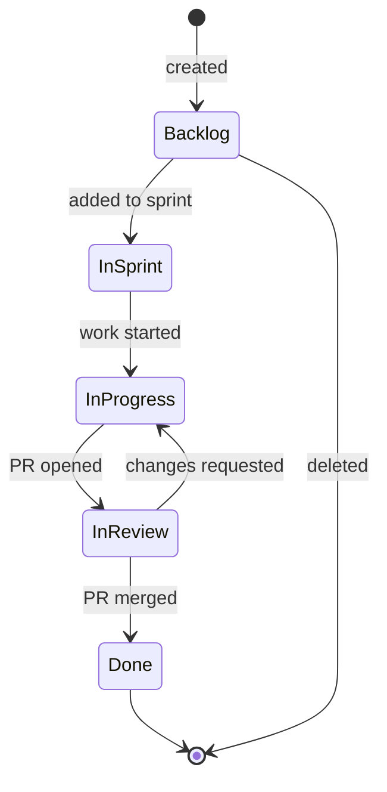

# Project service

Manages projects, epics, stories, tasks, comments, and change history.

**Port:** `8002` | **Schema:** `project` | **Redis:** `:6380`

## Story lifecycle

## API endpoints

| Method | Path | Description |
|---|---|---|
| `POST` | `/projects` | Create project |
| `GET` | `/projects/:id` | Get project |
| `GET` | `/projects/:id/epics` | List epics |
| `POST` | `/epics` | Create epic |
| `GET` | `/stories` | List stories (with filters) |
| `POST` | `/stories` | Create story |
| `PATCH` | `/stories/:id` | Update story |
| `GET` | `/stories/:id/history` | Change history |
| `POST` | `/stories/:id/comments` | Add comment |
