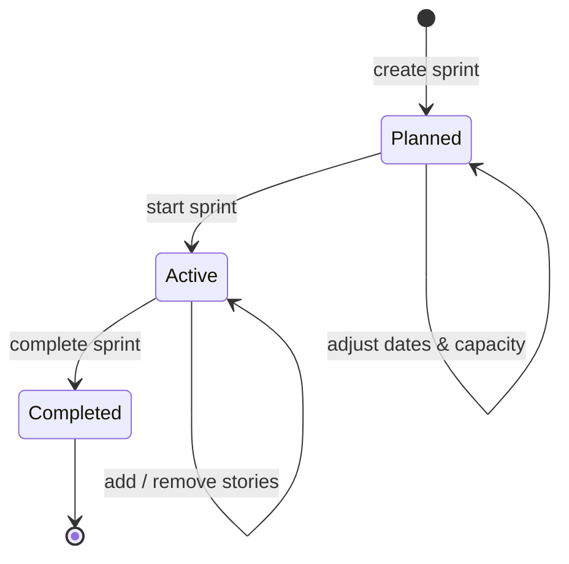
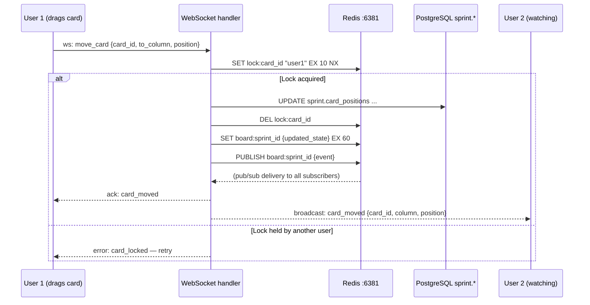
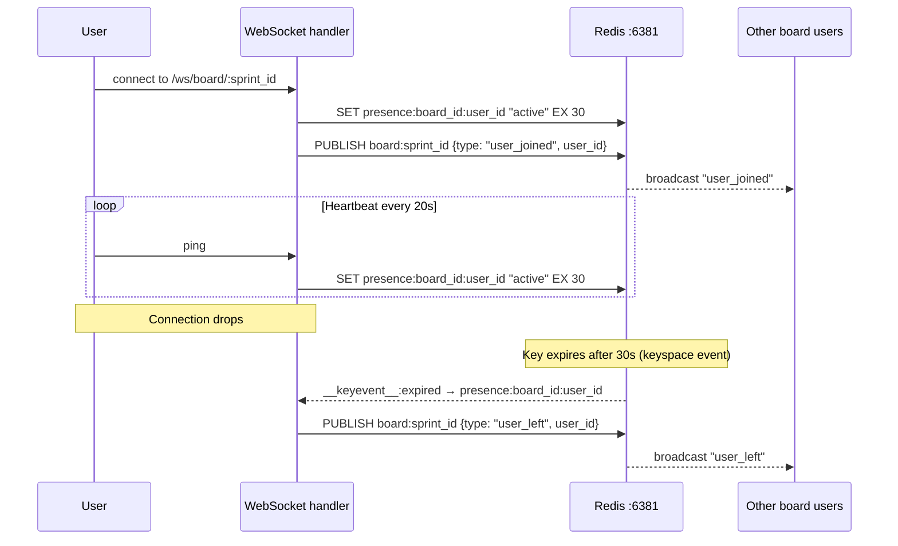
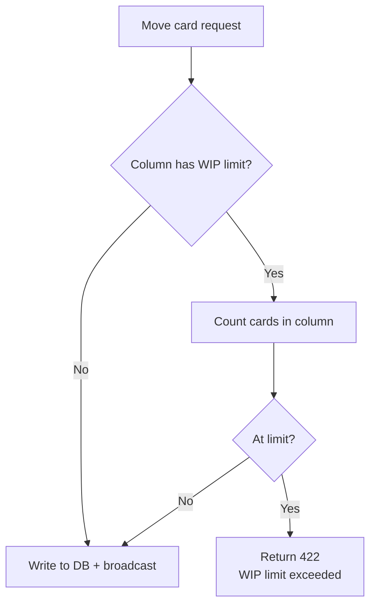

# Sprint service

The sprint service manages sprints, the kanban board, column configuration, card positions, and real-time collaboration. It is the most latency-sensitive service — board interactions must feel instant.

**Port:** `8003`  
**Database schema:** `sprint`  
**Redis:** `:6381` — board state, card locks, user presence, pub/sub for live updates

## Sprint lifecycle



## Kanban board — realtime architecture

The board uses WebSockets for all live interactions. When a card is moved, the service acquires a short Redis lock, writes to PostgreSQL, updates the Redis board cache, then broadcasts the event to all connected clients via Redis pub/sub.



## User presence



## WIP limits

When a card is moved to a column, the sprint service checks WIP limits before writing:



## API endpoints

| Method | Path | Description |
|---|---|---|
| `POST` | `/sprints` | Create sprint |
| `GET` | `/sprints/:id` | Get sprint detail |
| `PATCH` | `/sprints/:id/start` | Start sprint |
| `PATCH` | `/sprints/:id/complete` | Complete sprint |
| `GET` | `/sprints/:id/board` | Get full board state |
| `POST` | `/sprints/:id/items` | Add story to sprint |
| `DELETE` | `/sprints/:id/items/:story_id` | Remove story |
| `PATCH` | `/board/cards/:id/move` | Move card (REST fallback) |
| `WS` | `/ws/board/:sprint_id` | Live board WebSocket |
| `POST` | `/sprints/:id/retrospective` | Save retrospective |

## Rust WebSocket handler (outline)

```rust
use axum::extract::ws::{Message, WebSocket};

pub async fn board_ws_handler(
    ws: WebSocketUpgrade,
    State(state): State<SprintState>,
    Path(sprint_id): Path<Uuid>,
    Extension(user): Extension<AuthUser>,
) -> impl IntoResponse {
    ws.on_upgrade(move |socket| handle_board_socket(socket, state, sprint_id, user))
}

async fn handle_board_socket(
    mut socket: WebSocket,
    state: SprintState,
    sprint_id: Uuid,
    user: AuthUser,
) {
    // Register presence
    let presence_key = format!("presence:{}:{}", sprint_id, user.id);
    state.redis.set_ex(&presence_key, "active", 30).await;

    // Subscribe to board channel
    let channel = format!("board:{sprint_id}");
    let mut pubsub = state.redis.subscribe(&channel).await;

    loop {
        tokio::select! {
            // Incoming from client
            Some(Ok(msg)) = socket.recv() => {
                handle_client_message(&state, sprint_id, &user, msg).await;
            }
            // Broadcast from Redis pub/sub
            Some(event) = pubsub.next() => {
                let _ = socket.send(Message::Text(event)).await;
            }
        }
    }
}
```
