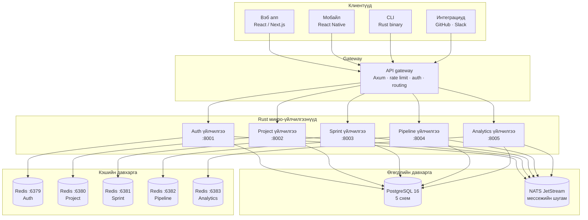

# Архитектурын тойм

AgilePlatform нь бие даасан Rust микро-үйлчилгээнүүдийн цуглуулга хэлбэрээр бүтээгдсэн. Үйлчилгээ бүр өөрийн PostgreSQL схем болон Redis жишээг эзэмшиж, нийтлэг NATS мессежийн шугамаар холбогдон, төв gateway-р дамжуулан REST болон WebSocket API-г нийтэд гаргана.

## Системийн диаграм

## Дизайны зарчмууд

### 1. Schema-per-service тусгаарлалт
Таван үйлчилгээ нэг PostgreSQL кластер хуваалцдаг боловч тус бүр өөрийн схемийг эзэмшдэг. Үйлчилгээний хэрэглэгчид зөвхөн өөрийн схемд хандах эрхтэй — `sprint_svc`-ийн асуулга `auth.users` хүснэгтийг уншиж чадахгүй.

### 2. Redis-per-service
Үйлчилгээ бүр өөрийн Redis жишээтэй бөгөөд тохируулсан `maxmemory-policy`-тай. Нийтлэг түлхүүрийн нэрийн орон зай байхгүй тул зөрчилдөөн гарахгүй, устгалтын зан үйл бие даасан байна.

### 3. Tokio-тэй Async-first
Үйлчилгээ бүр `tokio`-г ашиглан бүх `async/await` хэрэглэдэг — HTTP handler-аас мэдээллийн сангийн асуулга (`sqlx`) болон кэшийн үйлдэл (`deadpool-redis`) хүртэл.

### 4. NATS-аар Event-driven
Үйлчилгээ хоорондын харилцаа NATS JetStream event-ээр явагддаг, шууд HTTP дуудлагаар биш. Энэ нь үйлчилгээнүүдийг холбоогүй байлгаж, системийг хэсэгчилсэн доголдолд тэсвэртэй болгодог.

## Порт жагсаалт

| Үйлчилгээ | HTTP порт | Тайлбар |
|---|---|---|
| API Gateway | 3000 | Нийтэд нээлттэй оролт |
| Auth үйлчилгээ | 8001 | JWT, OAuth2, SSO |
| Project үйлчилгээ | 8002 | Төсөл, epic, story |
| Sprint үйлчилгээ | 8003 | Sprint, kanban самбар |
| Pipeline үйлчилгээ | 8004 | CI/CD дамжуулалт |
| Analytics үйлчилгээ | 8005 | Тайлан, хэмжүүр |
| PostgreSQL | 5432 | Үндсэн мэдээллийн сан |
| NATS | 4222 | Мессежийн шугам |
| Redis (auth) | 6379 | Auth кэш |
| Redis (project) | 6380 | Project кэш |
| Redis (sprint) | 6381 | Самбарын төлөв, оролцогч |
| Redis (pipeline) | 6382 | Ажлын дараалал, лог stream |
| Redis (analytics) | 6383 | Тайлангийн кэш |
