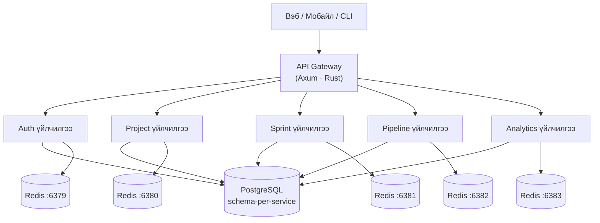

# AgilePlatform

**AgilePlatform** нь Rust backend дээр бүтээгдсэн өндөр гүйцэтгэлтэй, нээлттэй эхтэй agile төслийн менежментийн платформ юм. Jira эсвэл Azure DevOps-ийн хурдан, өөрөө байршуулах боломжтой, хялбар альтернатив гэж ойлгож болно.

## Яагаад AgilePlatform?

| | Jira | Azure DevOps | **AgilePlatform** |
|---|---|---|---|
| Backend хэл | Java | .NET | **Rust** |
| API хариу хугацаа | ~200–800ms | ~150–500ms | **~2–15ms** |
| Өөрөө байршуулах | Төлбөртэй | Төлбөртэй | **Үнэгүй** |
| Docker дүрс хэмжээ | ~800MB | ~1.2GB | **~35MB** |
| WebSocket холболт | Хязгаарлагдмал | Хязгаарлагдмал | **Нэг зангилаанд 100k+** |
| Нээлттэй эх | ✗ | ✗ | **✓** |

## Үндсэн боломжууд

- **Backlog & sprint төлөвлөлт** — epic, story, task, story point, velocity
- **Kanban самбар** — бодит цагийн drag-and-drop, WIP хязгаар, swimlane
- **CI/CD дамжуулалт** — YAML тодорхойлолттой зэрэгцээ үе шаттай дамжуулалт
- **Аналитик & тайлан** — burndown, velocity, cycle time, lead time, CFD
- **Бодит цагийн хамтын ажиллагаа** — WebSocket самбар оролцогчдын шууд шинэчлэлт
- **Интеграци** — GitHub, GitLab, Slack, Figma

## Архитектурын товч танилцуулга



## Хурдан эхлэл

```bash
# Repository клон хийх
git clone https://github.com/your-org/agile-platform
cd agile-platform

# Бүх дэд бүтцийг ажиллуулах
docker compose up -d

# Мэдээллийн сангийн шилжилт хийх
cargo run -p migrations

# Үйлчилгээ ажиллуулах
cargo run -p auth
```

Дэлгэрэнгүй зааврыг [Локал тохиргооны гарын авлага](./guides/local-setup)-аас үзнэ үү.
