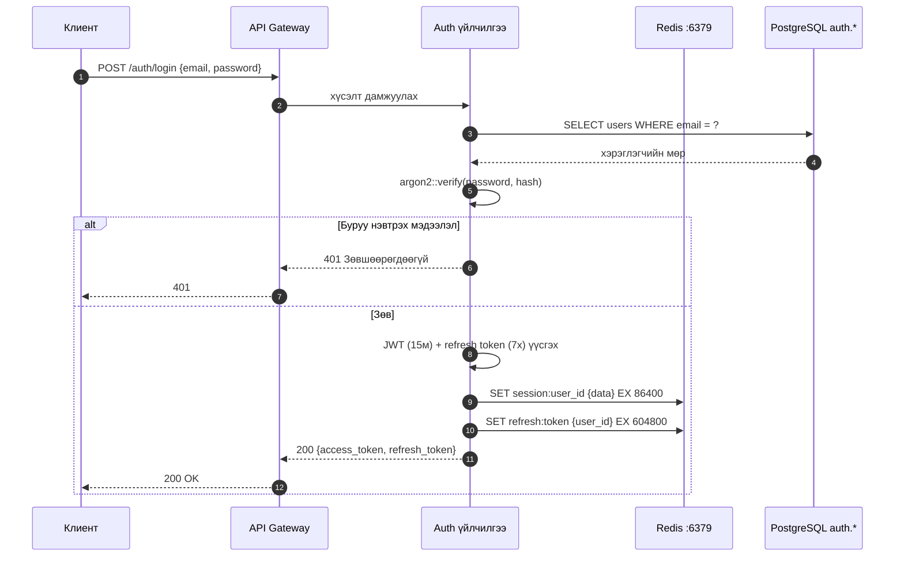
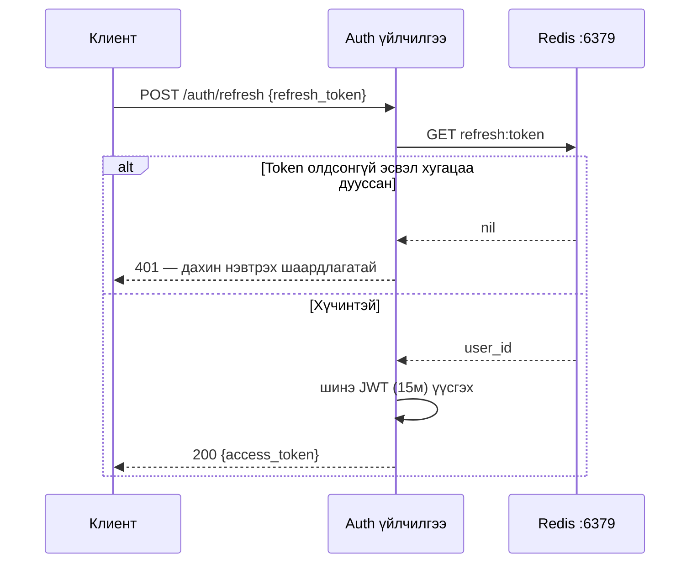

# Auth үйлчилгээ

Auth үйлчилгээ нь бүх таних тэмдэглэлийн асуудлыг шийддэг: бүртгэл, нэвтрэлт, JWT гаргах, OAuth2 (GitHub / Google / GitLab), API түлхүүр, байгууллагын удирдлага.

**Порт:** `8001`  
**Мэдээллийн сангийн схем:** `auth`  
**Redis:** `:6379` — сессүүд, JWT хар жагсаалт, хурдны хязгаарлалт, эрхийн кэш

## Нэвтрэлтийн урсгал



## Token сэргээх урсгал



## API endpoint-үүд

| Арга | Зам | Тайлбар |
|---|---|---|
| `POST` | `/auth/register` | Шинэ хэрэглэгч + байгууллага бүртгэх |
| `POST` | `/auth/login` | Email/нууц үгээр нэвтрэх |
| `POST` | `/auth/refresh` | Access token сэргээх |
| `POST` | `/auth/logout` | Сессийг цуцлах |
| `GET` | `/auth/me` | Одоогийн хэрэглэгчийн профайл |
| `GET` | `/auth/oauth/:provider` | OAuth2 урсгал эхлүүлэх |
| `POST` | `/auth/api-keys` | API түлхүүр үүсгэх |
| `DELETE` | `/auth/api-keys/:id` | API түлхүүр цуцлах |

## JWT бүтэц

```json
{
  "sub": "018e4b2a-uuid-хэрэглэгч-id",
  "org": "018e4b2a-uuid-байгууллага-id",
  "role": "admin",
  "jti": "018e4b2a-uuid-token-id",
  "iat": 1712000000,
  "exp": 1712000900
}
```

:::tip Богино хугацаатай access token
Access token **15 минут**-д хугацаа дуусна. Энэ нь алдагдсан token-ий хохирлыг хязгаарладаг. Refresh token (7 хоног) нь `httpOnly` хэлбэрээр хадгалагдаж, JavaScript-ээс хандах боломжгүй.
:::
